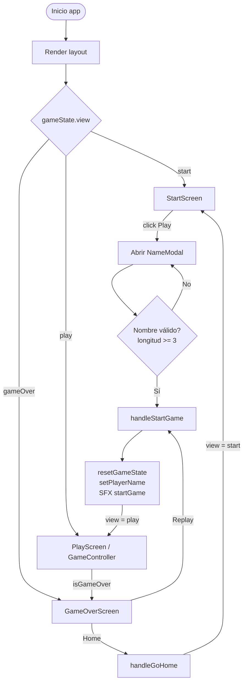
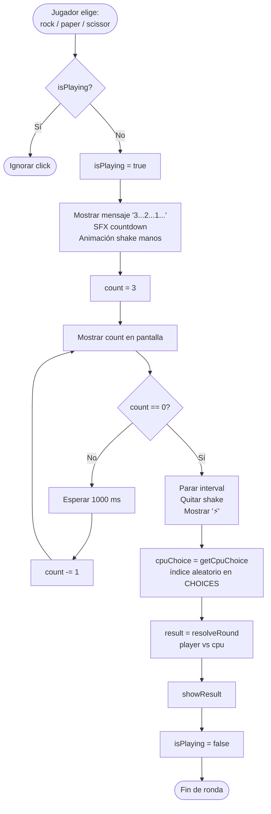
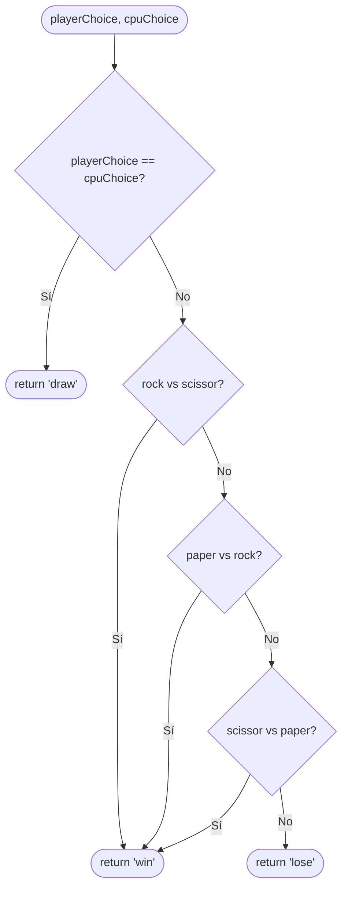
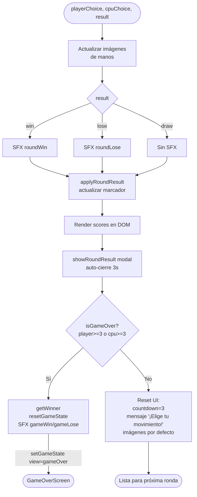
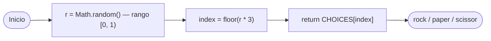
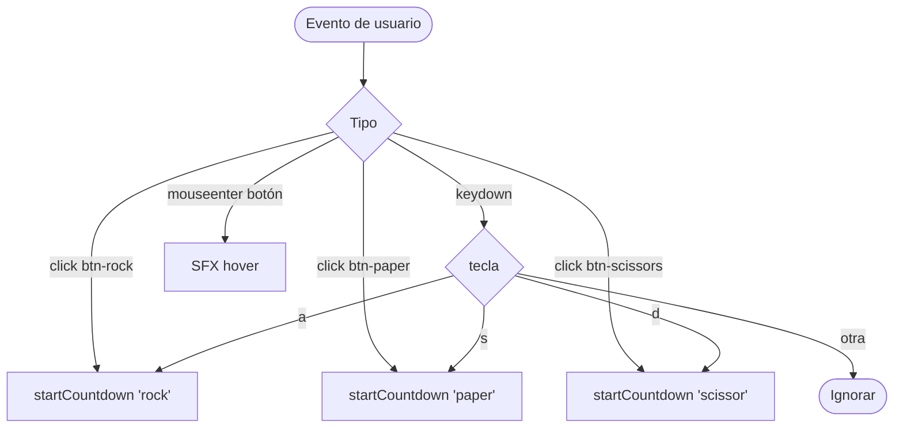
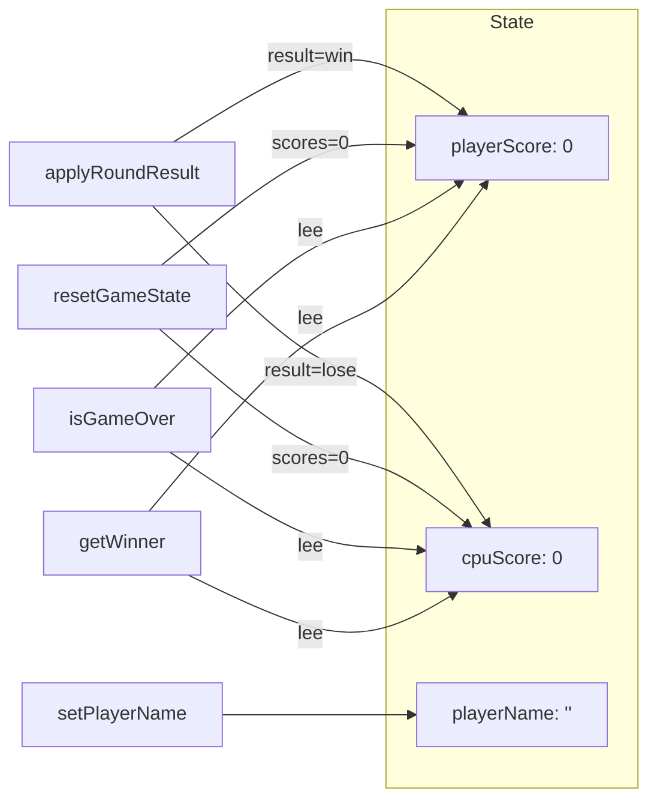

# Flowcharts — Lógica del Juego

Diagramas de los algoritmos principales del juego **Piedra, Papel o Tijera**.
Las APIs externas (clima, noticias, geolocalización) quedan fuera de este alcance.

---

## 1. Flujo general de la aplicación (máquina de estados de vistas)

Controlada por `setGameState` en [index.js](../index.js) que re-renderiza según `gameState.view`.

---

## 2. Algoritmo de una ronda (countdown + resolución)

Implementado en [gameController.js](../scripts/ui/gameController.js) y [gameService.js](../scripts/services/gameService.js).

---

## 3. Algoritmo `resolveRound` (decidir ganador de la ronda)

Función pura en [gameService.js:14](../scripts/services/gameService.js#L14).

---

## 4. Flujo de `showResult` (aplicar resultado y verificar fin de partida)

Sección `showResult` en [gameController.js:25](../scripts/ui/gameController.js#L25).

---

## 5. Selección CPU — `getCpuChoice`

Función en [gameService.js:9](../scripts/services/gameService.js#L9).

---

## 6. Entrada: click y atajos de teclado

Binding en [gameController.js:112](../scripts/ui/gameController.js#L112).

---

## 7. Estado global del juego (`gameService` state)

---

## Constantes clave

| Constante | Valor | Origen |
|---|---|---|
| `CHOICES` | `["rock","paper","scissor"]` | [game.js:1](../scripts/constants/game.js#L1) |
| `WIN_SCORE` | `3` | [game.js:3](../scripts/constants/game.js#L3) |
| `COUNTDOWN_START` | `3` | [game.js:4](../scripts/constants/game.js#L4) |
| `COUNTDOWN_INTERVAL_MS` | `1000` | [game.js:5](../scripts/constants/game.js#L5) |
| `MIN_LENGTH` (nombre) | `3` | [nameModal.js:1](../scripts/ui/nameModal.js#L1) |
