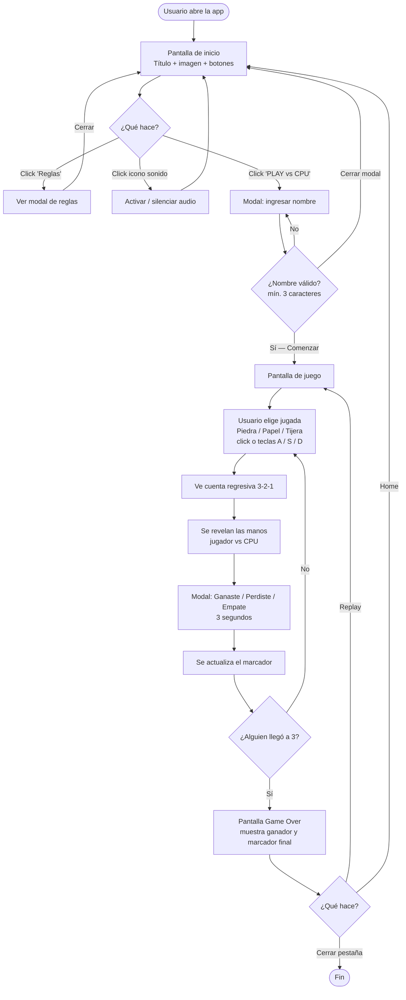
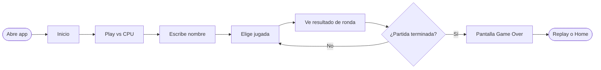

# User Flow — Piedra, Papel o Tijera

Diagrama del recorrido del usuario desde que abre la app hasta que termina una partida.
A diferencia de los flowcharts técnicos, aquí se modelan **acciones y pantallas que ve el jugador**, no la lógica interna.

---

## 1. User Flow completo

---

## 2. Recorrido feliz (happy path) simplificado

---

## 3. Pantallas y acciones disponibles

| Pantalla | Acciones del usuario | Siguiente pantalla |
|---|---|---|
| **Inicio** | Click `PLAY vs CPU` | Modal Nombre |
| **Inicio** | Click `Reglas` | Modal Reglas (overlay) |
| **Inicio** | Click icono sonido | Toggle audio (misma pantalla) |
| **Modal Nombre** | Escribir nombre + Enter / Comenzar | Juego |
| **Modal Nombre** | Click `×` / fuera / Esc | Inicio |
| **Juego** | Click Piedra/Papel/Tijera | Countdown → Resultado |
| **Juego** | Teclas `A` / `S` / `D` | Countdown → Resultado |
| **Modal Ronda** | (Auto-cierre 3s) | Siguiente ronda o Game Over |
| **Game Over** | Click `Replay` | Juego (nueva partida) |
| **Game Over** | Click `Home` | Inicio |

---
